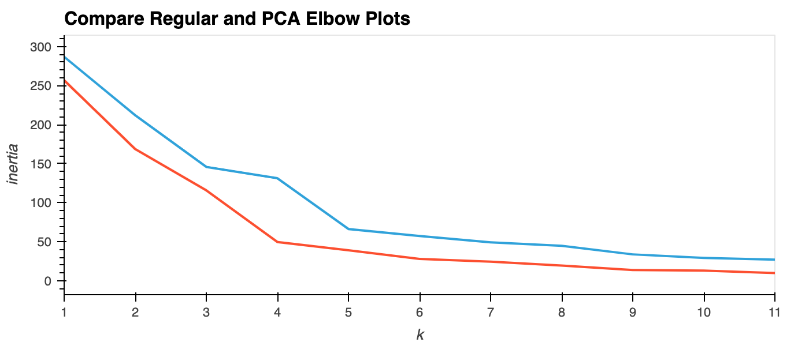
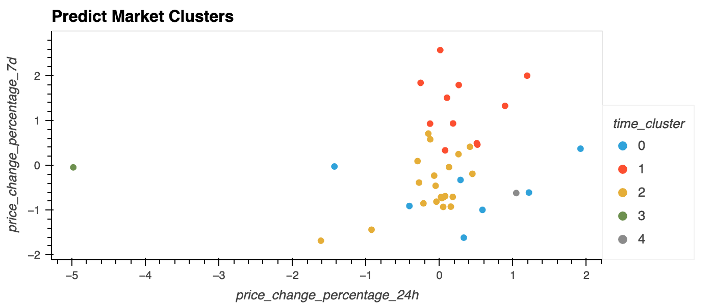
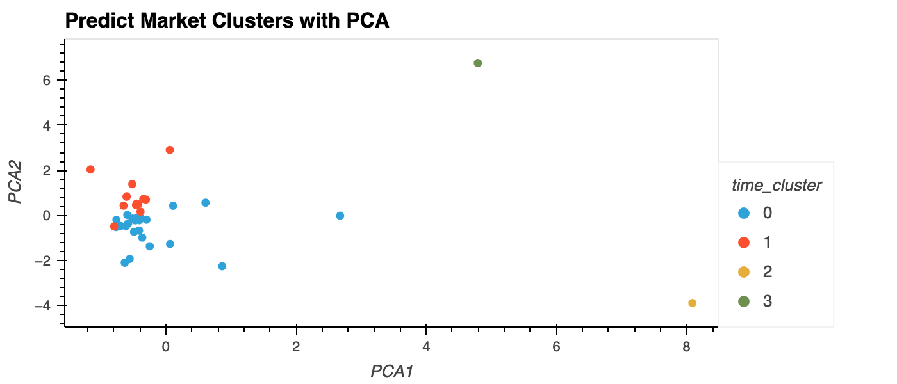

# crytpocluster

Using `KMeans` to predict clusters of cryptocurrency market data.

## Results

### Elbow Plots



### Cluster Predictions




## Code

### Libraries

#### SciKit-Learn

https://scikit-learn.org/

```sh
# pip
pip install -U scikit-learn

# conda
conda install -c conda-forge scikit-learn
```

**Starter code provided by edX*